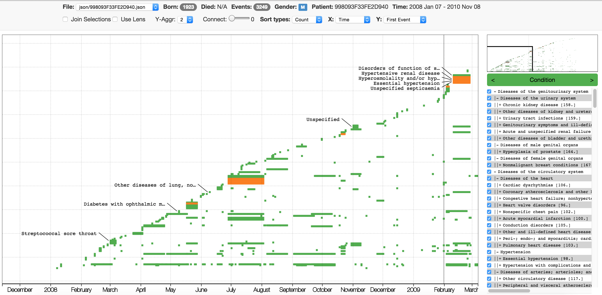

# patient-viz

*patient-viz* is a tool allowing to view and explore electronic medical records
or other time sequence event data. The web-based tool is mostly written in
[d3](http://d3js.org/) and uses [python](https://www.python.org/) and shell on the back-end.
Example data from medical insurance claim data can be downloaded automatically.
We also have a [live demo](http://nyuvis.github.io/patient-viz/index.html)!
The project is a joint product of [Josua Krause](http://josuakrause.github.io/info/), Narges Sharif Razavian,
Enrico Bertini, and [David Sontag](http://cs.nyu.edu/~dsontag/).
A short description of how to read the visualization can be found in the PDFs
linked in the [publications section](#publications).

[](http://nyuvis.github.io/patient-viz/index.html)

[](https://travis-ci.org/nyuvis/patient-viz)

## Setup

Setting up the project can be done without prerequisites on *MacOS* and *linux*.
For windows you need to install [git](https://git-for-windows.github.io/) and
[python](https://www.python.org/downloads/) and use *git BASH* to execute shell commands.

*patient-viz* supports three data formats as input:

* OMOP Common Data Model: A PostgreSQL based data model. Instructions for setting
  up the connection can be found [here](#omop-common-data-model).

* CMS Data Model: A tabular data model in CSV files. Example data is openly available.
  Instructions on how to set up the tool for CMS data and how to download example data
  can be found [here](cms_shelve.md#cms-setup).

* Shelve DB: A faster wrapper for CMS data. Instructions can be
  found [here](cms_shelve.md#using-shelve-input).

## OMOP Common Data Model

*patient-viz* can connect to PostgreSQL databases in the
[OMOP Common Data Model](https://github.com/OHDSI/CommonDataModel/).
In order to do so you can use the following commands (assuming a fresh clone
of the repository):

```bash
./setup.sh --default-omop
```

or

```bash
./setup.sh --default-omop --apt
```

if `apt-get` is available on your system.
Installing `psycopg2` on MacOS may fail. In this case please refer to the
[psycopg installation guide](http://initd.org/psycopg/docs/install.html).

Note: Dependency installation may require sudo rights and will prompt as needed.
Do *not* run `setup.sh` with sudo.

You will be prompted questions to configure the connection to the PostgreSQL database
containing the data. Using the external CCS hierarchy and caching are recommended
options that allow for a richer and smoother user experience.

After successfully configuring the connection you can run

```bash
./server.py
```

to start the visualization server. Please refer to `./server.py -h` for command
line arguments. With the default command line arguments (ie. none) you can now
browse `http://localhost:8080/patient-viz/`
(Note that `patient-viz` in the URL depends on the name of the folder that
contains `server.py`).

If you want to inspect a certain patient you can browse to
the corresponding id directly. For example, to show the patient with the
`person_id` *1234* as found in the `person` table you can browse:

```
http://localhost:8080/patient-viz/?p=json/1234&d=json/dictionary.json
```

You can also use the `person_source_value` using a different notation. The
patient with the `person_source_value` of *12345678* can be found at:
```
http://localhost:8080/patient-viz/?p=json/12345678.json&d=json/dictionary.json
```
(Note the `.json` after the id)

If you want to stop the server you can type `quit` into its console or issue a
keyboard interrupt via `CTRL-C`. Type `help` for available server commands.

Updating the git repository to the newest version found on Github should be
done via `./setup.sh --update` as it cleans the cache and updates
dependencies as well.

## Publications

* 2015 Workshop on Visual Analytics in Healthcare - Demo [[PDF]](pub/vahc_2015_demo.pdf)
* AMIA 2015 Annual Symposium - Demo [[PDF]](pub/amia_2015_demo.pdf)

## Contributing

Pull requests are highly appreciated :)
Also, feel free to open [issues](https://github.com/nyuvis/patient-viz/issues) for any questions or bugs you may encounter.
